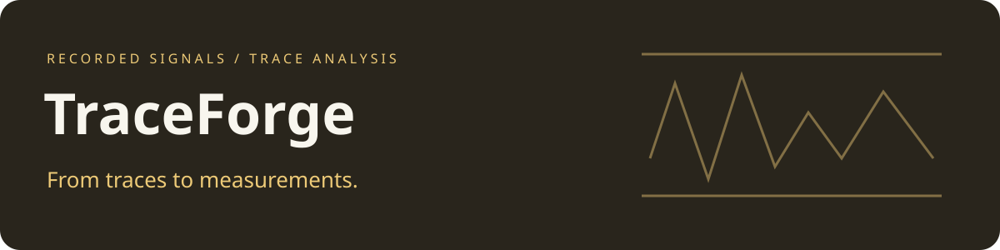

# TraceForge

**Development history:** Developed locally using Git before publication. These projects were published to GitHub together, so similar upload dates do not indicate when development began.

A Python workspace for electromagnetic trace processing, correlation metrics and model-based analysis.

## Workspace map

| Component | Role |
| --- | --- |
| `emma/processing/` | Trace transformations and processing operations |
| `emma/metrics/` | Correlation and distance accumulators |
| `emma/ai/` | Model definitions, losses and training helpers |
| `emma/io/` | Dataset and trace representations |
| `emma.py` | Existing analysis command-line entry point |
| `emcap.py` | Existing capture entry point |

## Environment and workflow

The pinned requirements target an older Python ecosystem, including TensorFlow 1.14 and Keras 2.2.5. Use a matching isolated environment when reproducing existing experiments. Package names, command names, configuration sections and serialized formats are preserved.

[Configuration and workflow](docs/WORKFLOW.md) covers the existing local and worker-based commands. [Preservation checks](COMPATIBILITY.md) records the narrower offline validation performed for this publication.

The bundled ASCAD companion files retain their separate [notice](ascad/LICENSE_ASCAD).

## Source terms

First-party source is available under the [MIT license](LICENSE). Separate bundled components and external modules retain their own terms.
